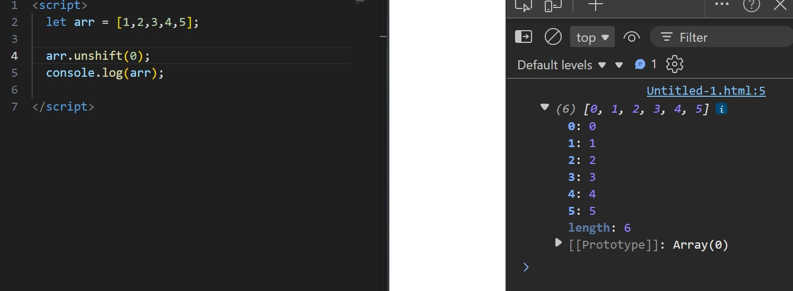
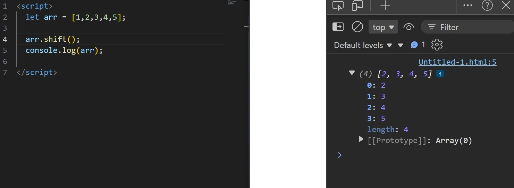
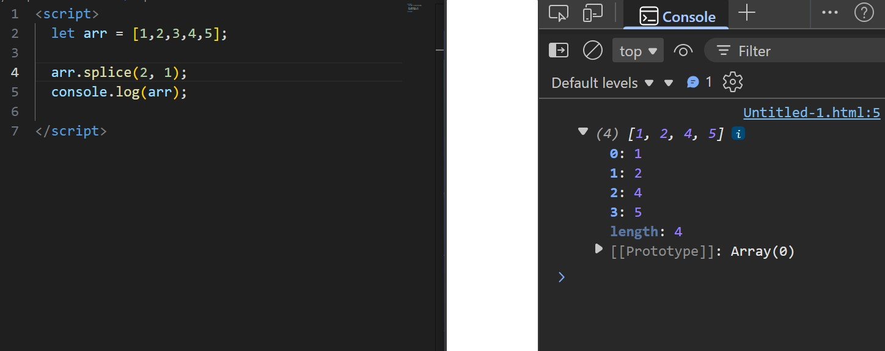
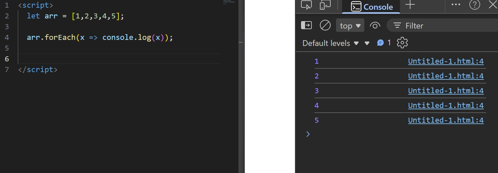
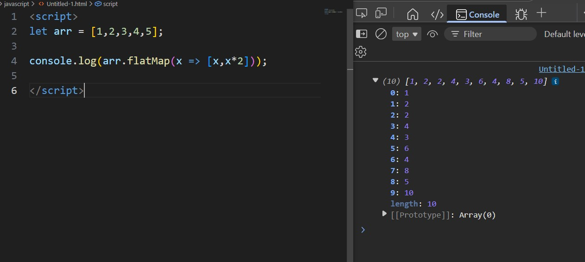
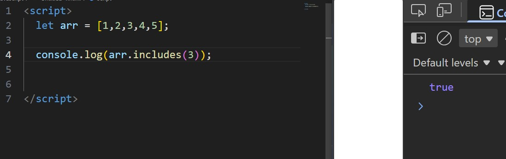

## 📸 Screenshots

---

## Add/ Remove

### ➕ push()

### ➖ pop()

### ⬅️ unshift()

### ➡️ shift()

### ✂️ splice() – Remove at Index

### ✨ splice() – Insert at Index

---

## Iteration/ Transform

### 🔄 map()

### 🔁 forEach()

### 🔁 flatMap()

---

## Search/ Find

### 🎯 find()

### 📍 findIndex()

### 🔚 findLast()

### 🔚 findLastIndex()

### ✅ includes()

### 📌 indexOf()

### 📌 lastIndexOf()

---

## Filter/ Reduce

### ### 🔍 filter()

