## 📸 Screenshots

---

## Add/ Remove

### ➕ push()

### ➖ pop()

### ⬅️ unshift()

### ➡️ shift()

### ✂️ splice() – Remove at Index

### ✨ splice() – Insert at Index

---

## Iteration/ Transform

### 🔄 map()

### 🔁 forEach()

### 🔁 flatMap()

---

## Search/ Find

### 🎯 find()

### 📍 findIndex()

### 🔚 findLast()
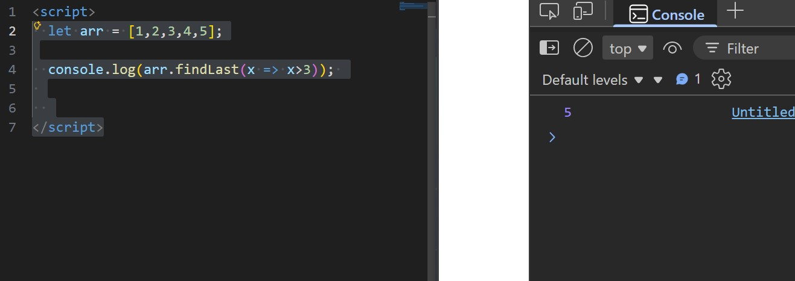

### 🔚 findLastIndex()
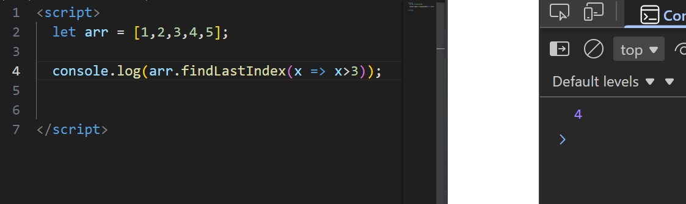

### ✅ includes()

### 📌 indexOf()

### 📌 lastIndexOf()
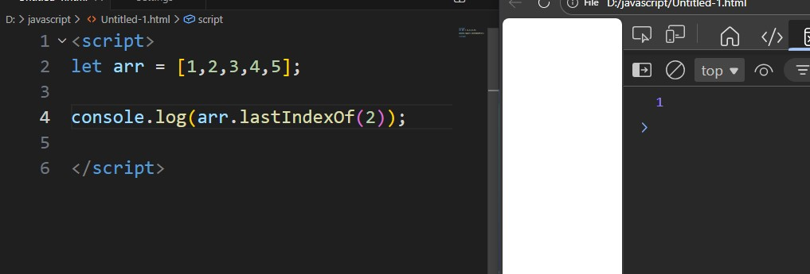

---

## Filter/ Reduce

### 🔍 filter()

### ✅ reduce()

### ✅ reduceRight()

---

### Boolean Checks

### 🔘 some()
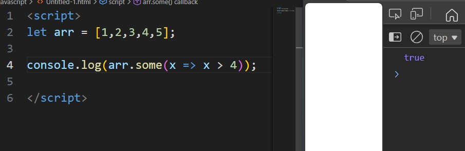

### ✅ every()
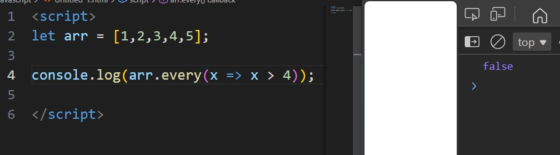

---

## Order/ Sort

### 🔃 sort()
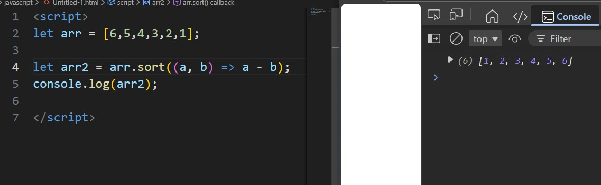

### 🔄 reverse()
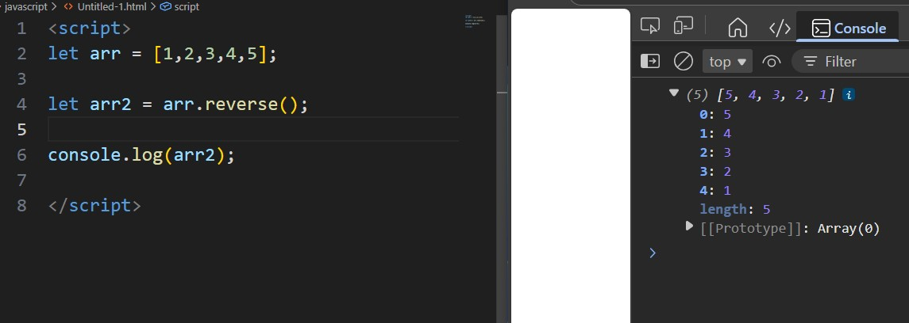

### 🆕 toSorted()
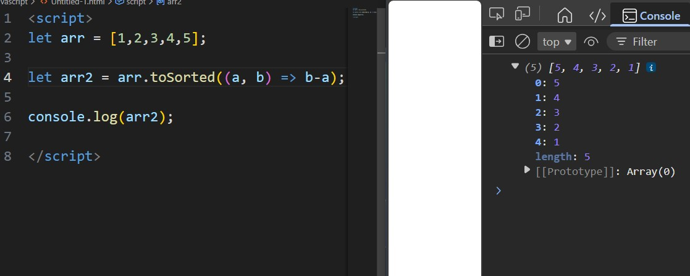

### 🆕 toReversed()
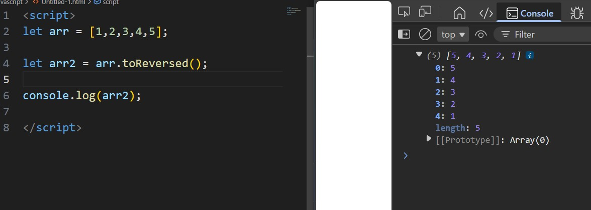

---

## Slice/ Copy/ Replace

### ✂️ slice()
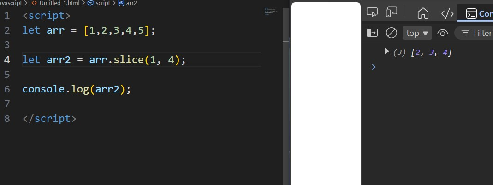

### ✨ with()
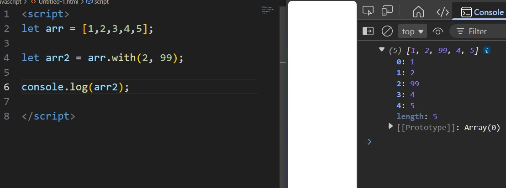

### 🆕 toSplice()
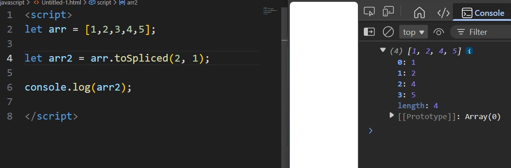

### 🆕 toSpliced()
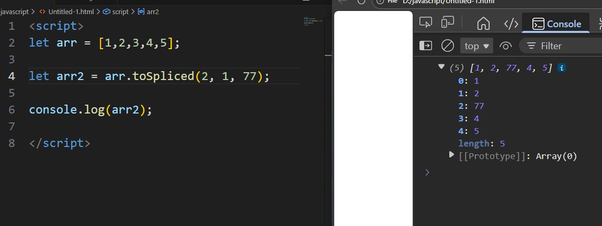

---

## Combine/ Convert

### ➕ concat()
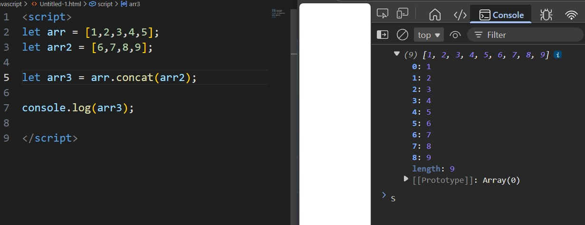

### 🔗 join()
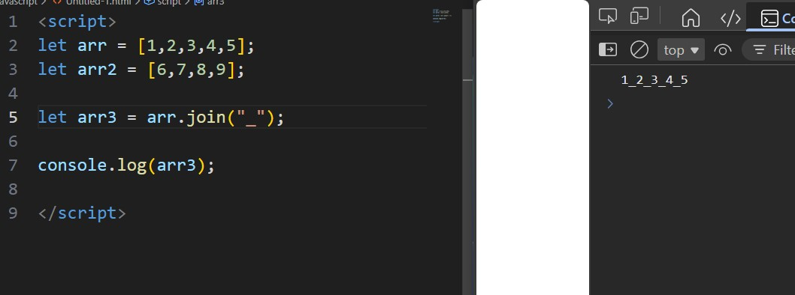

### 🔤 toString()
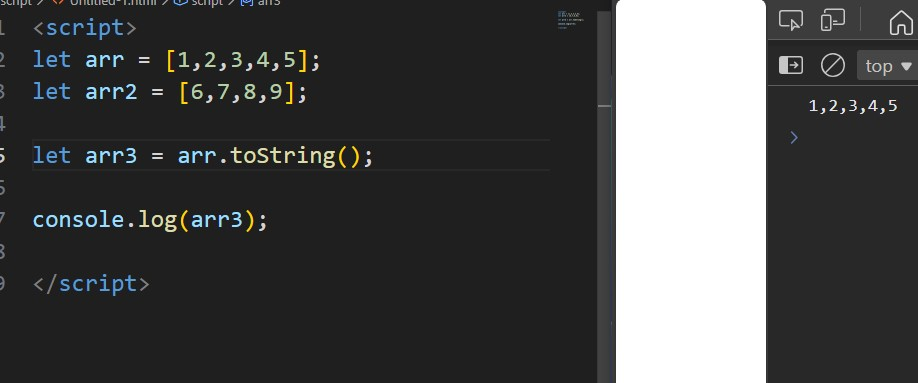

---

## Structure Helpers

### 📏 flat()
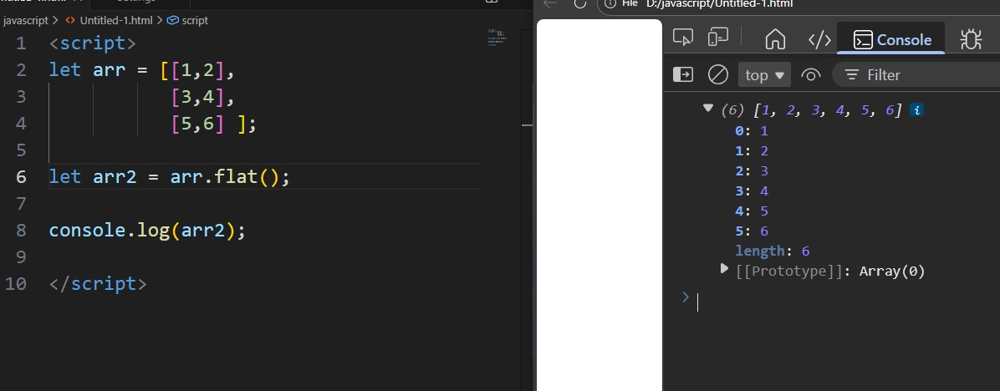

### ❓ Array.isArray()
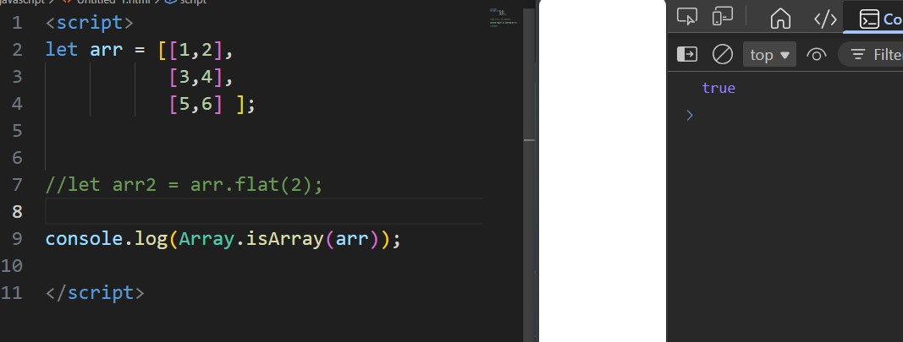

### 🖌 fill()
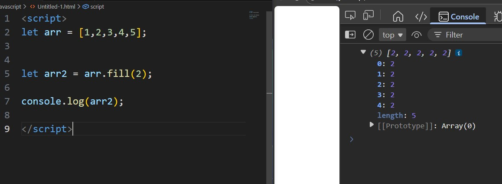

### 📋 copyWithin()
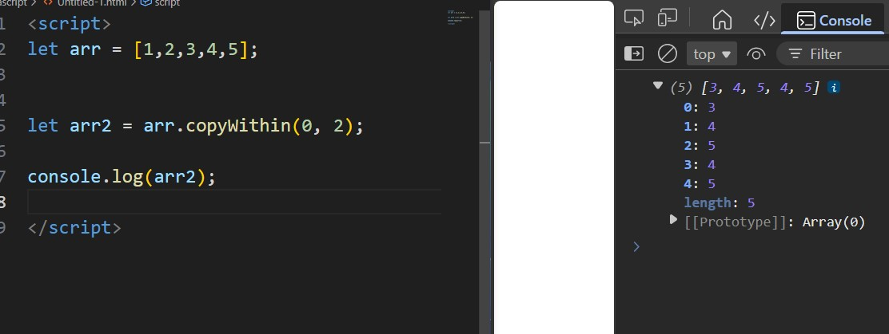

---

## Info

### 📐 length
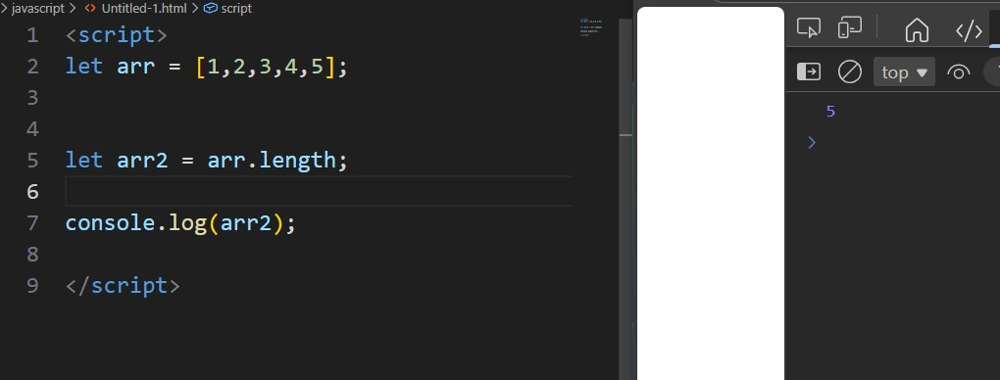

### 📑 entries()
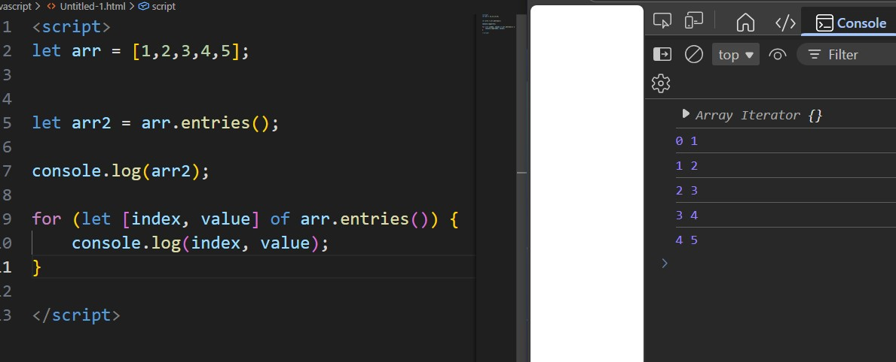

### 🔑 keys()
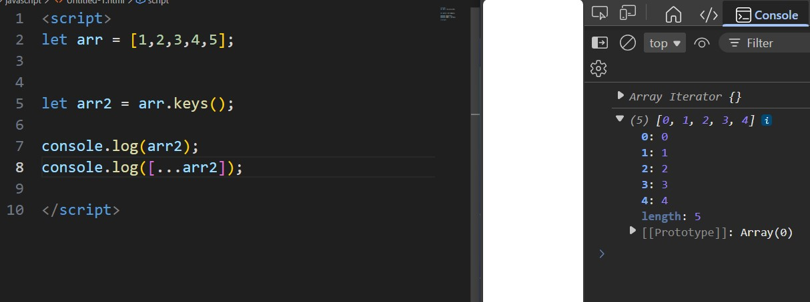

### 💎 values()

---

## Creation

### 📥 Array.from()
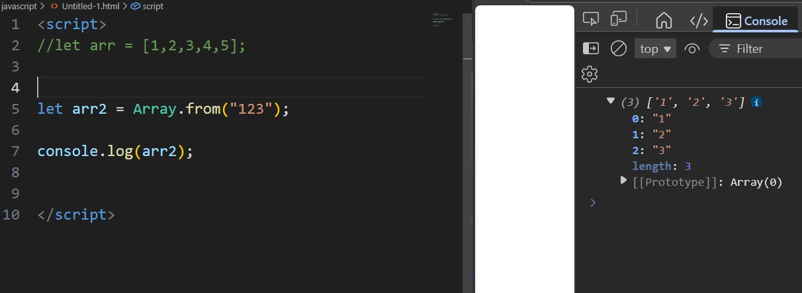

### 📤 Array.of()
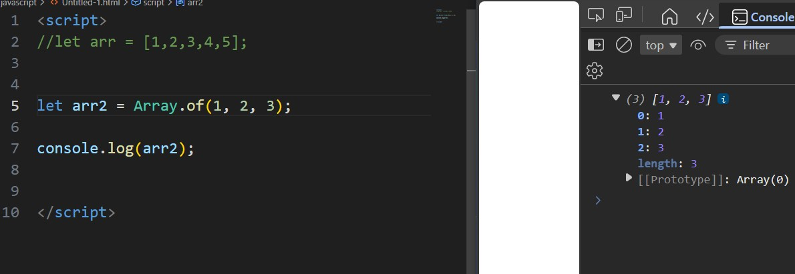

---
## Spread

### 🔀 Combined [...arr1, ...arr2]
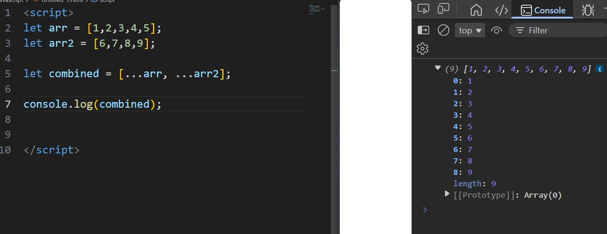

---
✅ Done
---

